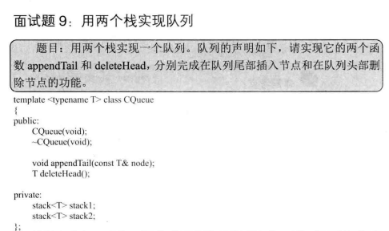
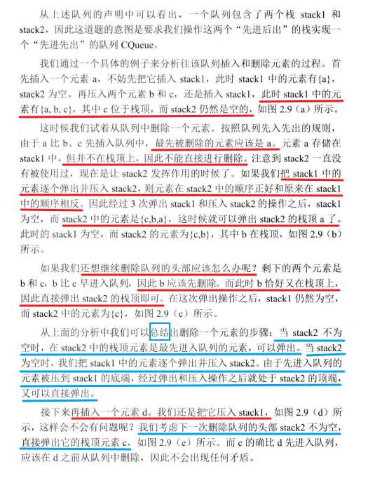

 

 

 

总结：

1. **入队**：所有新值都先压入栈1。
2. 出队：
   - 如果栈2非空，则直接弹出栈2顶部的值。
   - 如果栈2为空，则将栈1中的所有元素依次弹出并压入栈2，这样原来的顺序就被反转，栈2顶部就是队列的队头元素，然后弹出该元素。

这种方式就实现了队列的先进先出（FIFO）特性。

```c#
using System;
using System.Collections.Generic;

public class CQueue<T>
{
    private Stack<T> stack1;
    private Stack<T> stack2;

    public CQueue()
    {
        stack1 = new Stack<T>();
        stack2 = new Stack<T>();
    }

    // 将元素添加到队尾
    public void AppendTail(T element)
    {
        stack1.Push(element);
    }

    // 删除队头元素并返回
    public T DeleteHead()
    {
        if (stack2.Count == 0)
        {
            while (stack1.Count > 0)
            {
                T data = stack1.Pop();
                stack2.Push(data);
            }
        }

        if (stack2.Count == 0)
            throw new Exception("queue is empty");

        return stack2.Pop();
    }
}
```

