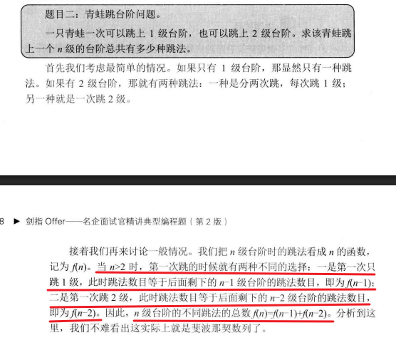
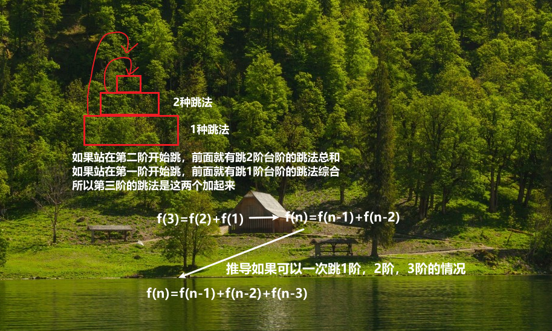

 
分析：
**寻找规律**

- 从简单的情况入手，归纳一般规律：
  - **f(1) = 1**：只有1种跳法（直接跳1阶）。
  - **f(2) = 2**：两种跳法（跳1阶两次，或跳2阶一次）。
- 对于任意n：
  - 如果青蛙从n-1级台阶跳1阶到n，剩下的跳法数是 **f(n-1)**。
  - 如果青蛙从n-2级台阶跳2阶到n，剩下的跳法数是 **f(n-2)**。
  - **总跳法数 f(n) = f(n-1) + f(n-2)**。

这就是递推公式（即数学模型的核心部分）。

### **构建数学模型**

使用递推关系：

- 初始条件：f(1) = 1, f(2) = 2。

- 递推公式：**f(n) = f(n-1) + f(n-2)，n ≥ 3**。

### **推广与优化**

  - 如果台阶跳法不止1阶和2阶，比如还可以跳3阶，则递推公式变为 **f(n) = f(n-1) + f(n-2) + f(n-3)**。
  - 如果问题有更多限制（例如必须用尽所有台阶），可以调整递推逻辑。

$$
\\f(n)
\begin{cases}
f(1) = 1, \\
f(2) = 2,\\
f(n) = f(n-1) + f(n-2)
\end{cases}
$$
