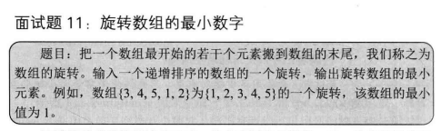
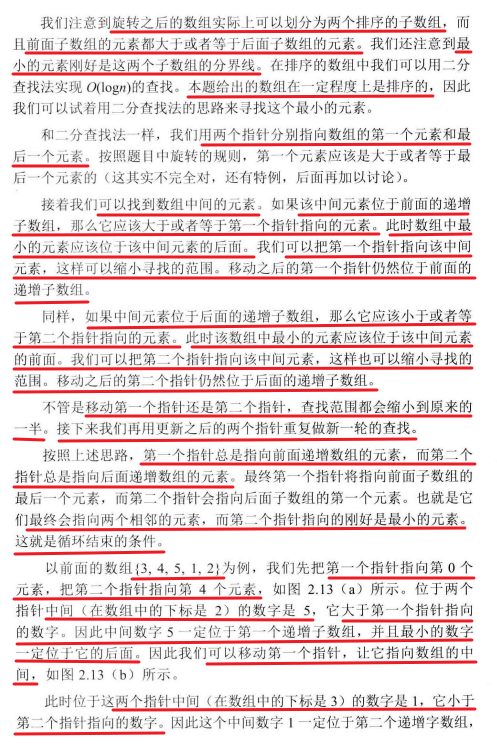
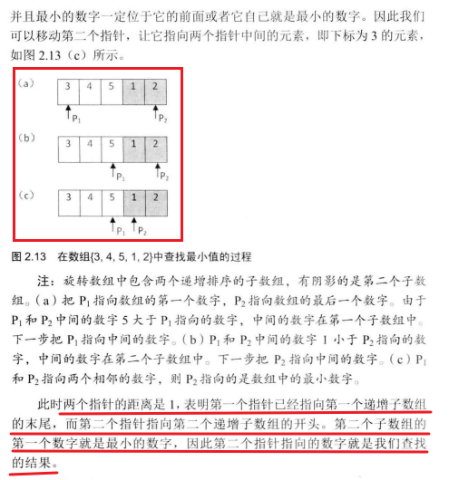
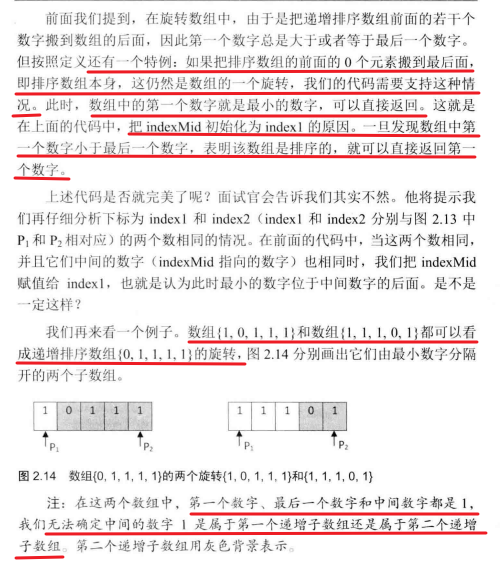
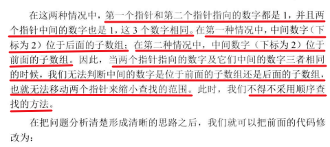

 

 

 

```c#
using System;

public class MinFinder
{
    public static int Min(int[] numbers)
    {
        // 参数检查，确保输入数组有效
        if (numbers == null || numbers.Length <= 0)
            throw new ArgumentException("输入错误");

        // 设定搜索范围的起始索引
        int index1 = 0;
        int index2 = numbers.Length - 1;
        int indexMid = index1;
        
        // 如果数组未旋转，直接返回第一个元素
        if (arrays[left] < arrays[right])
        {
            return arrays[left];
        }
        
        // 旋转数组的特点：前半部分的元素大于后半部分的元素，因此最小值通常在右半部分
        while (numbers[index1] >= numbers[index2])
        {
            // 当 index1 和 index2 仅相差 1 时，index2 所指向的元素就是最小值
            if (index2 - index1 == 1)
            {
                indexMid = index2;
                break;
            }

            // 计算中间索引
            indexMid = (index1 + index2) / 2;

            // 通过中间元素的值来确定搜索范围的收缩方向
            if (numbers[indexMid] >= numbers[index1])
            {
                // 如果中间元素大于或等于起始元素，说明最小值仍在右半部分
                index1 = indexMid;
            }
            else if (numbers[indexMid] <= numbers[index2])
            {
                // 如果中间元素小于或等于结束元素，说明最小值可能在左半部分
                index2 = indexMid;
            }
        }

        // 返回最终找到的最小值
        return numbers[indexMid];
    }

    // 测试用例
    public static void Main()
    {
        int[] numbers = { 3, 4, 5, 1, 2 };
        Console.WriteLine("数组中的最小值: " + Min(numbers));
    }
}
```

 

 

```c#
using System;

class Program
{
    // 查找旋转排序数组中的最小值
    static int Min(int[] numbers)
    {
        // 参数检查：确保数组不为空且长度大于 0
        if (numbers == null || numbers.Length == 0)
            throw new ArgumentException("Invalid parameters"); // 抛出异常，防止非法输入

        // 定义两个指针：index1 指向数组开头，index2 指向数组结尾
        int index1 = 0;
        int index2 = numbers.Length - 1;
        int indexMid = index1; // 初始化中间变量
        
        // 如果数组未旋转，直接返回第一个元素
        if (arrays[left] < arrays[right])
        {
            return arrays[left];
        }
        
        // 使用二分查找法，直到找到最小值
        while (numbers[index1] >= numbers[index2])
        {
            // 如果两个指针相邻，则 index2 处的值为最小值
            if (index2 - index1 == 1)
            {
                indexMid = index2;
                break;
            }

            // 计算中间索引
            indexMid = (index1 + index2) / 2;

            // 如果 index1、indexMid 和 index2 指向的值都相等，则无法使用二分查找，只能顺序查找
            if (numbers[index1] == numbers[index2] && numbers[indexMid] == numbers[index1])
                return MinInOrder(numbers, index1, index2); // 进入顺序查找模式

            // 根据中间值与 index1 和 index2 的关系，调整搜索范围
            if (numbers[indexMid] >= numbers[index1])
                index1 = indexMid; // 最小值应该在右半部分
            else if (numbers[indexMid] <= numbers[index2])
                index2 = indexMid; // 最小值应该在左半部分
        }

        // 返回找到的最小值
        return numbers[indexMid];
    }

    // 顺序查找函数：用于处理无法使用二分查找的情况
    static int MinInOrder(int[] numbers, int index1, int index2)
    {
        int result = numbers[index1]; // 假设初始最小值为 index1 处的值

        // 遍历范围内的所有元素，找到最小值
        for (int i = index1 + 1; i <= index2; i++)
        {
            if (result > numbers[i]) // 如果发现更小的值，则更新
                result = numbers[i];
        }
        return result; // 返回最小值
    }

    // 主函数：测试代码
    static void Main()
    {
        int[] numbers = { 3, 4, 5, 1, 2 }; // 定义旋转排序数组
        Console.WriteLine("最小值: " + Min(numbers)); // 输出最小值
    }
}

```

**总结**

1.数组分为左右两个数组，左边曾序，右边增序

2.二分比较两个数组，直到左右索引差值=1

3.
