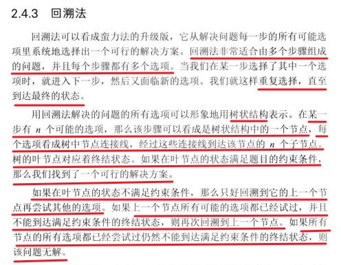
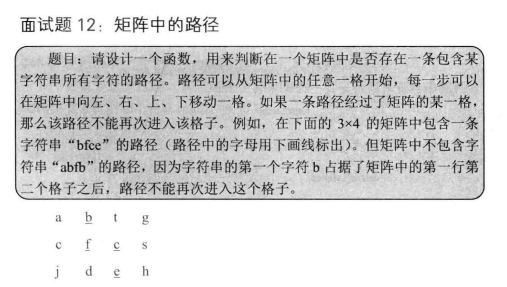
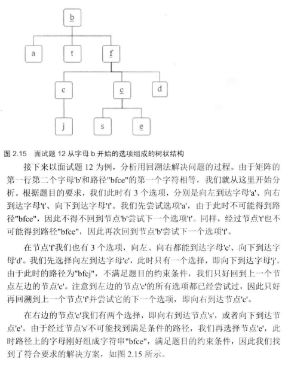
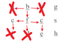
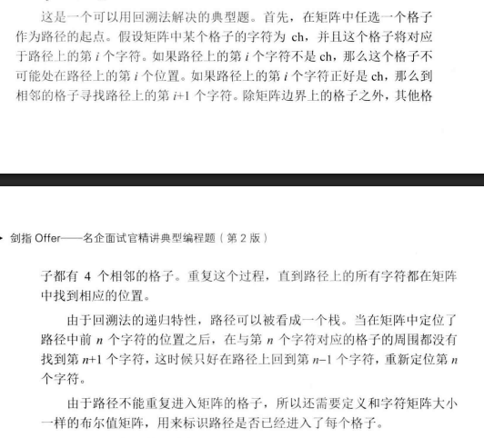

 

 

 

 

 

```c#
/// <summary>
/// 用于在二维字符矩阵中查找指定路径的类
/// </summary>
public class PathFinder
{
    /// <summary>
    /// 主入口方法：判断矩阵中是否存在指定路径
    /// </summary>
    /// <param name="matrix">二维字符矩阵(按行优先顺序存储的一维数组)</param>
    /// <param name="rows">矩阵行数</param>
    /// <param name="cols">矩阵列数</param>
    /// <param name="str">需要查找的路径字符串</param>
    /// <returns>是否找到路径</returns>
    public bool HasPath(char[] matrix, int rows, int cols, string str)
    {
        // 参数有效性检查
        if (matrix == null || rows < 1 || cols < 1 || str == null)
            return false;

        // 创建访问标记数组，记录每个位置是否已经被访问过
        bool[] visited = new bool[rows * cols];
        int pathLength = 0; // 当前已匹配的路径长度

        // 遍历矩阵中的每个位置作为起点
        for (int row = 0; row < rows; row++)
        {
            for (int col = 0; col < cols; col++)
            {
                // 从当前起点开始递归搜索
                if (HasPathCore(matrix, rows, cols, row, col, str, ref pathLength, visited))
                {
                    return true; // 找到路径立即返回
                }
            }
        }

        return false; // 所有起点尝试后未找到路径
    }

    /// <summary>
    /// 递归核心方法：从指定位置开始深度优先搜索
    /// </summary>
    /// <param name="matrix">字符矩阵</param>
    /// <param name="rows">总行数</param>
    /// <param name="cols">总列数</param>
    /// <param name="row">当前行坐标</param>
    /// <param name="col">当前列坐标</param>
    /// <param name="str">目标路径</param>
    /// <param name="pathLength">已匹配的路径长度（引用类型参数）</param>
    /// <param name="visited">访问标记数组</param>
    /// <returns>是否找到完整路径</returns>
    private bool HasPathCore(
        char[] matrix, 
        int rows, 
        int cols, 
        int row, 
        int col, 
        string str, 
        ref int pathLength, 
        bool[] visited)
    {
        // 递归终止条件：已匹配所有字符
        if (pathLength >= str.Length)
            return true;

        bool hasPath = false;
        
        // 检查当前位置是否有效：
        // 1. 坐标在矩阵范围内
        // 2. 当前矩阵字符与目标字符串对应位置字符匹配
        // 3. 该位置未被访问过
        if (row >= 0 && row < rows && 
            col >= 0 && col < cols && 
            matrix[row * cols + col] == str[pathLength] && 
            !visited[row * cols + col])
        {
            pathLength++; // 匹配成功，路径长度+1
            visited[row * cols + col] = true; // 标记当前位置已访问

            // 向四个方向递归搜索（使用逻辑或的短路特性优化搜索）
            // 顺序：左 -> 上 -> 右 -> 下
            hasPath = 
                HasPathCore(matrix, rows, cols, row, col - 1, str, ref pathLength, visited) || // 向左
                HasPathCore(matrix, rows, cols, row - 1, col, str, ref pathLength, visited) || // 向上
                HasPathCore(matrix, rows, cols, row, col + 1, str, ref pathLength, visited) || // 向右
                HasPathCore(matrix, rows, cols, row + 1, col, str, ref pathLength, visited);   // 向下

            // 回溯处理：如果四个方向都未找到路径
            if (!hasPath)
            {
                pathLength--; // 回退路径长度
                visited[row * cols + col] = false; // 清除访问标记
            }
        }

        return hasPath;
    }
}


// 测试用例（3x4矩阵）：
// A B C E
// S F C S
// A D E E
char[] matrix = { 'A','B','C','E', 'S','F','C','S', 'A','D','E','E' };

var finder = new PathFinder();
Console.WriteLine(finder.HasPath(matrix, 3, 4, "ABCCED")); // 输出 True
Console.WriteLine(finder.HasPath(matrix, 3, 4, "SEE"));    // 输出 True
Console.WriteLine(finder.HasPath(matrix, 3, 4, "ABCB"));   // 输出 False
```

