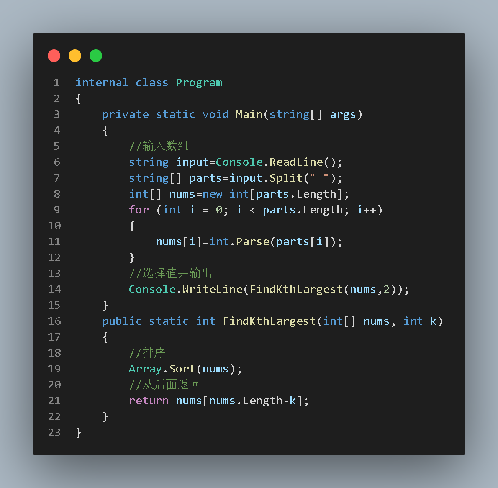

# 算法三

**题目 3：查找数组中第 k 大的元**

给定一个整数数组 nums 和一个整数 k，请编写一个方法来查找数组中第 k 大的元素。请注意，你需要实现一个算法，该算法在时间复杂度上优于 O(n^2) 的朴素解法。

例如，给定数组 [3,2,1,5,6,4] 和 k = 2，应返回 5，因为数组中第 2 大的元素是 5。



如果遇到大数据则效率不高，应选择快速选择算法

```
步骤 1：选择基准（Pivot）
首先，从数组中选择一个基准（pivot）元素。这个基准元素用于将数组分为两部分，一部分小于等于基准元素，另一部分大于基准元素。
步骤 2：分区（Partition）
将数组分区，使得所有小于等于基准的元素都位于基准的左侧，所有大于基准的元素都位于基准的右侧。分区过程结束后，基准元素位于其最终排序的位置上。
步骤 3：判断基准位置
检查基准元素的位置 pivotIndex 是否就是我们想要的第 k 小（或第 k 大）元素的位置。
* 如果 pivotIndex == k，那么 nums[k] 就是我们要找的第 k 小（或第 k 大）元素。
* 如果 pivotIndex > k，则第 k 小（或第 k 大）元素在左侧部分，需要在左侧部分继续递归寻找。
* 如果 pivotIndex < k，则第 k 小（或第 k 大）元素在右侧部分，需要在右侧部分继续递归寻找。
步骤 4：递归或返回结果
根据基准位置判断的结果，递归地对左侧或右侧部分继续应用快速选择算法，直到找到第 k 小（或第 k 大）元素。
```
