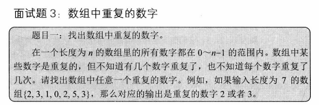
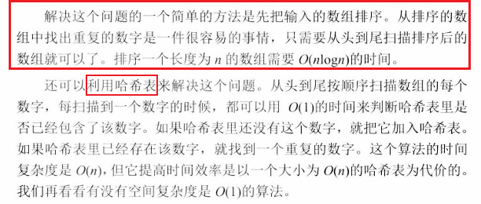
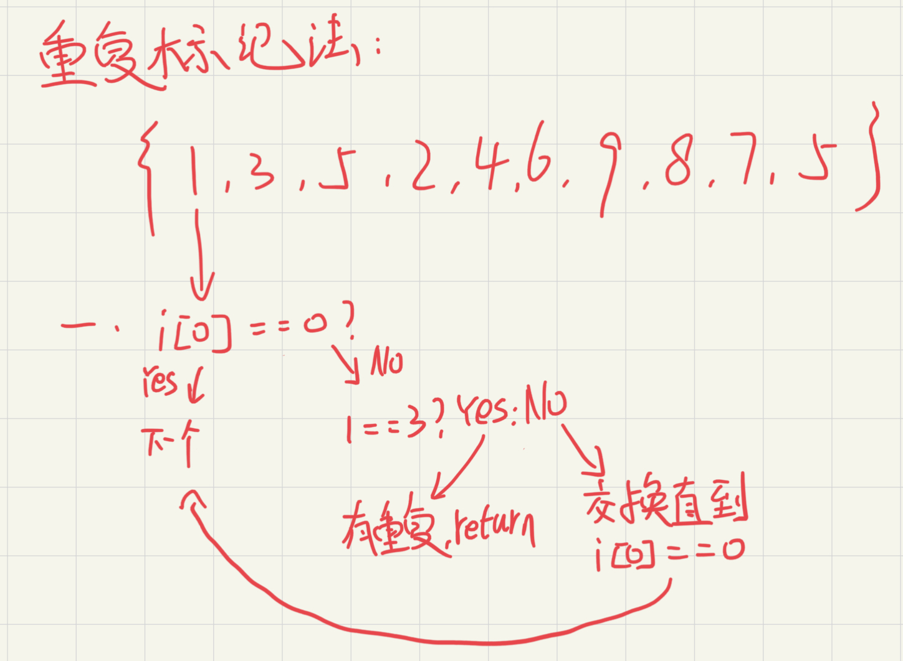

# 算法四：数组中重复的数字





哈希表和重复标记法都可以找出重复的值




```c#
class DuplicateChecker{//筛选出数组重复的值,哈希表

    public bool Dulicate(int[] ints,out int repeat){

        repeat=-1;

        //判断数组长度是否为空合法

        if(ints.Length<=0){

            return false;

        }

        //判断数组内的值是否在0~n-1区间

        for (int i = 0; i <ints.Length; i++)

        {

            if (ints[i]<0||ints[i]>ints.Length)

            {

                return false;

            }

        }

        for(int i = 0; i <ints.Length; i++)

        {

            while(ints[i]!=i){

                if (ints[i]==ints[ints[i]])

                {

                    repeat=ints[i];

                    return true;

                }

                int temp=ints[i];

               ints[i]=ints[ints[i]];

               ints[temp]=temp;

            }

        }

        return false;

    }

}

class Program{

    public static void Main(string[] args){

        int repeat;

        DuplicateChecker duplicateChecker=new DuplicateChecker();

        int[] array={2,1,3,4,5,6,5};//6 0~5

        duplicateChecker.Dulicate(array,out repeat);

        Console.WriteLine(repeat);

    }

}

哈希表

class Program{

    public static void Main(string[] args){

        int[] array={2,1,3,4,5,6,5,66,66};//6 0~5

        List<int> list=new List<int>();

        Hashtable hashTable=new Hashtable();

        for (int i = 0; i < array.Length; i++)

        {

            if (hashTable.Contains(array[i]))//判断哈希表中是否存在

            {

                list.Add(array[i]);//存在就代表着重复，添加到list列表中

            }else{

                hashTable.Add(array[i],null);//不存在就将其添加到哈希表中

            }  

        }

        foreach (int item in list)

        {

            Console.WriteLine(item);

        }

    }

}
```

