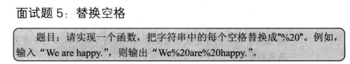
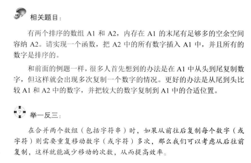

 
步骤：接收字符串
1.得到数组实际长度
2.得到空格的数量
|
3.通过空格数量创建一个新的数组
|
4.从后面开始往前遍历，遇到空格就替换填入新数组，没有则正常填值进去
5.将char数组变成字符串输出回来

```c#
using System;
using System.Collections.Generic;
using System.Linq;
using System.Text;
using System.Threading.Tasks;

namespace 替换空格
{
    using System;
    using System.Collections.Generic;
    using System.Linq;
    using System.Text;
    using System.Threading.Tasks;
    class Program
    {
        static void Main(string[] args)
        {
            string str = "we are happy";
            //str.Count(c=>c==' ')方法是找到字符串中这个字符有多少个满足条件的字符
            //只有c++才需要目标数组长度，因为怕溢出，但是c#不会，
            //C#在每次数组访问时都会自动进行边界检查，而C++不会。
            test.ReplaceBlank(ref str,str.Length+str.Count(c=>c==' ')*2);
                                                                         
            Console.WriteLine(str);
        }
    }
    class test
    {
        public static void ReplaceBlank(ref string str, int length)
        {
            if (string.IsNullOrEmpty(str) || length <= 0)
                return;

            // originalLength 为字符串 str 的实际长度
            int originalLength = str.Length;
            int numberOfBlank = 0;

            // 计算字符串中空格的个数
            for (int i = 0; i < originalLength; ++i)
            {
                if (str[i] == ' ')
                    ++numberOfBlank;
            }

            // newLength 为把空格替换成"%20"之后的长度
            int newLength = originalLength + numberOfBlank * 2;
            if (newLength > length)
                return;

            // 使用字符数组来构建新字符串
            char[] newStr = new char[newLength];
            int indexOfOriginal = originalLength - 1;//旧数组的最后一个值
            int indexOfNew = newLength - 1;//新数组的最后一个值

            // 从后往前遍历字符串，
            while (indexOfOriginal >= 0 && indexOfNew >= 0)
            {
                if (str[indexOfOriginal] == ' ')//如果当前值是空格，则新数组的这个位置反方向插入20%
                {
                    newStr[indexOfNew--] = '0';
                    newStr[indexOfNew--] = '2';
                    newStr[indexOfNew--] = '%';
                }
                else//如果当前不是空格，则将其赋值给新数组，新数组索引并且-1
                {
                    newStr[indexOfNew--] = str[indexOfOriginal];
                }
                --indexOfOriginal;
            }
            // 将替换后的字符数组转换回字符串
            str = new string(newStr);
        }
    }
}
```

 
