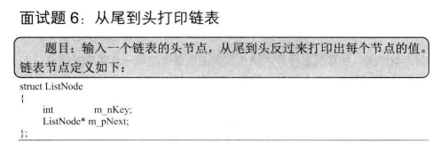

```c#
using System;
using System.Collections.Generic;

namespace MainMenu
{
    class Program
    {
        static void Main(string[] args)
        {
            LinkedList<int> list = new LinkedList<int>();
            list.Add(1);
            list.Add(2);
            list.Remove();
            list.PrintAll();
        }
    }

    /// <summary>
    /// 单向链表的实现
    /// </summary>
    class LinkedList<T>
    {
        /// <summary>
        /// 内部节点类，表示链表中的一个节点
        /// </summary>
        private class Node
        {
            /// <summary>
            /// 指向下一个节点的引用
            /// </summary>
            public Node Next { get; set; }
            
            /// <summary>
            /// 节点存储的值
            /// </summary>
            public T Value { get; }

            /// <summary>
            /// 初始化节点
            /// </summary>
            /// <param name="value">要存储的值</param>
            public Node(T value)
            {
                Next = null;
                Value = value;
            }
        }

        /// <summary>
        /// 链表头部节点
        /// </summary>
        private Node _head;
        
        /// <summary>
        /// 链表尾部节点
        /// </summary>
        private Node _tail;

        /// <summary>
        /// 向链表末尾添加新节点
        /// </summary>
        /// <param name="value">要添加的值</param>
        public void Add(T value)
        {
            Node newNode = new Node(value);
            if (_head == null)
            {
                _head = _tail = newNode;
                return;
            }
            _tail.Next = newNode;
            _tail = newNode;
        }

        /// <summary>
        /// 移除链表的最后一个节点
        /// </summary>
        public void Remove()
        {
            if (_head == null)
            {
                return; // 链表为空，无需移除
            }
            else if (_head == _tail)
            {
                _head = _tail = null; // 只有一个节点时，直接清空链表
                return;
            }

            Node current = _head;
            while (current.Next != null && current.Next != _tail)
            {
                current = current.Next;
            }
            _tail = current;
            _tail.Next = null; // 移除最后一个节点
        }

        /// <summary>
        /// 以倒序方式打印链表中的所有元素
        /// </summary>
        public void PrintAll()
        {
            Stack<T> stack = new Stack<T>(); // 使用栈存储节点以实现倒序输出
            Node current = _head;
            while (current != null)
            {
                stack.Push(current.Value);
                current = current.Next;
            }
            while (stack.Count > 0)
            {
                Console.WriteLine(stack.Pop()); // 依次输出栈中的值
            }
        }
    }
}

```