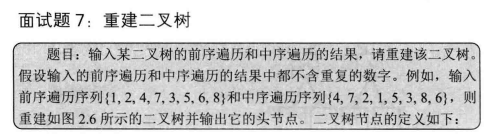
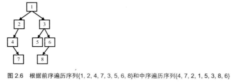
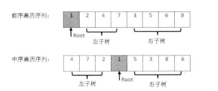

  

 

 

前序遍历：preorder traversal
中序遍历：inorder travisal
后序遍历：Postorder tranvisal

二叉树节点：BinaryTreeNode
构建二叉树：BinaryTreeBuilder
```c#
class Program
    {
        static void Main(string[] args)
        {
            // 测试数据
            int[] preorder = { 1, 2, 4, 7, 3, 5, 6, 8 };
            int[] inorder = { 4, 7, 2, 1, 5, 3, 8, 6 };

            // 构建二叉树
            BinaryTreeNode root = BinaryTreeBuilder.Construct(preorder, inorder);

            // 验证二叉树结构
            Console.WriteLine("前序遍历结果：");
            PreorderTraversal(root);
            Console.WriteLine();

            Console.WriteLine("中序遍历结果：");
            InorderTraversal(root);
            Console.WriteLine();

            Console.WriteLine("后序遍历结果：");
            PostorderTraversal(root);
            Console.WriteLine();
        }

        // 前序遍历（根-左-右）
        static void PreorderTraversal(BinaryTreeNode root)
        {
            if (root == null) return;
            Console.Write(root.Value + " ");
            PreorderTraversal(root.Left);
            PreorderTraversal(root.Right);
        }

        // 中序遍历（左-根-右）
        static void InorderTraversal(BinaryTreeNode root)
        {
            if (root == null) return;
            InorderTraversal(root.Left);
            Console.Write(root.Value + " ");
            InorderTraversal(root.Right);
        }

        // 后序遍历（左-右-根）
        static void PostorderTraversal(BinaryTreeNode root)
        {
            if (root == null) return;
            PostorderTraversal(root.Left);
            PostorderTraversal(root.Right);
            Console.Write(root.Value + " ");
        }
    }
    // 二叉树节点类
    public class BinaryTreeNode
    {
        public int Value { get; set; }
        public BinaryTreeNode Left { get; set; }
        public BinaryTreeNode Right { get; set; }

        public BinaryTreeNode(int value = 0)
        {
            Value = value;
            Left = null;
            Right = null;
        }
    }

    public class BinaryTreeBuilder
    {
        /// <summary>
        /// 根据前序和中序遍历序列构建二叉树（主入口）
        /// </summary>
        /// <param name="preorder">前序序列数组</param>
        /// <param name="inorder">中序序列数组</param>
        /// <returns>根节点</returns>
        public static BinaryTreeNode Construct(int[] preorder, int[] inorder)
        {
            if (preorder == null || inorder == null || preorder.Length != inorder.Length || preorder.Length == 0)
                throw new ArgumentException("Invalid input");

            return ConstructCore(
                preorder, 0, preorder.Length - 1,
                inorder, 0, inorder.Length - 1
            );
        }

        /// <summary>
        /// 递归核心构建函数
        /// </summary>
        /// <param name="preorder">前序序列数组</param>
        /// <param name="preStart">前序子序列起始索引</param>
        /// <param name="preEnd">前序子序列结束索引</param>
        /// <param name="inorder">中序序列数组</param>
        /// <param name="inStart">中序子序列起始索引</param>
        /// <param name="inEnd">中序子序列结束索引</param>
        private static BinaryTreeNode ConstructCore(
            int[] preorder, int preStart, int preEnd,
            int[] inorder, int inStart, int inEnd)
        {
            // 创建根节点（前序第一个元素）
            int rootValue = preorder[preStart];
            BinaryTreeNode root = new BinaryTreeNode(rootValue);

            // 终止条件：单个节点
            if (preStart == preEnd)//找到最后一个节点
            {
                if (inStart == inEnd && preorder[preStart] == inorder[inStart])
                    return root;
                else
                    throw new ArgumentException("Invalid input");
            }

            // 在中序序列中定位根节点位置
            int rootInIndex = inStart;
            while (rootInIndex <= inEnd && inorder[rootInIndex] != rootValue)
                rootInIndex++;

            if (rootInIndex > inEnd) // 未找到根节点
                throw new ArgumentException("Invalid input");

            // 计算左子树长度
            int leftLength = rootInIndex - inStart;//中序的根节点-开始节点=左子树的长度
            // 递归构建左子树（如果存在）
            if (leftLength > 0)//左子树长度大于0就要构建左子树
            {
                root.Left = ConstructCore(
                    preorder, preStart + 1, preStart + leftLength,
                    inorder, inStart, rootInIndex - 1
                );
            }

            // 递归构建右子树（如果存在）
            if (preStart + leftLength < preEnd)//前序开始节点+左子树的长度<前序的结束几点
            {
                root.Right = ConstructCore(
                    preorder, preStart + leftLength + 1, preEnd,
                    inorder, rootInIndex + 1, inEnd
                );
            }

            return root;
        }
    }
```

