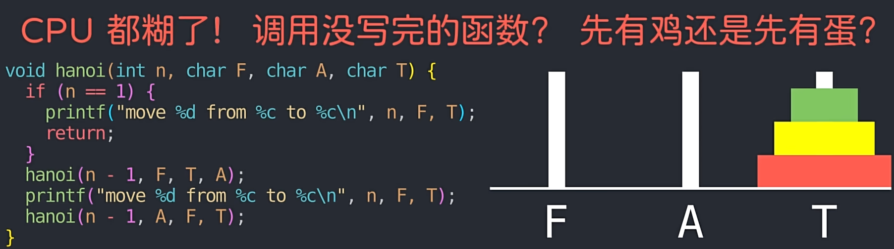

# 什么是递归

举例：5的阶乘

using System;

class Program

{

    static void Main(string[] args)

    {

        //实现阶乘 5!=5*4*3*2*1

        //f(n)={1 n=1

        //     f(n-1)*n) n>1}

        Console.WriteLine(fact(5));

        int fact(int n){

            if (n==1)

            {

                return 1;

            }else{

               return fact(n-1)*n;

            }

        }

    }

}

---

---

会产生重复递归的性能问题

优化：记忆化搜索

public class Fibonacci

{

    // 保存斐波那契数列结果的列表

    private List<int> saved;

    // 构造函数，初始化列表

    public Fibonacci(int n)

    {

        // 初始化列表长度为 n+1，并将所有元素设为 -1，表示未计算

        saved = new List<int>(new int[n + 1]);

        for (int i = 0; i <= n; i++)

        {

            saved[i] = -1;

        }

    }

    // 计算第 n 个斐波那契数

    public int Fib(int n)

    {

        // 如果 n 小于等于 2，直接返回 1

        if (n <= 2) return 1;

        // 如果第 n 个斐波那契数尚未计算过，则进行计算并保存结果

        if (saved[n] == -1)

        {

            saved[n] = Fib(n - 1) + Fib(n - 2);

        }

        // 返回已保存的第 n 个斐波那契数

        return saved[n];

    }

}

using System;

class Program

{

    static void Main(string[] args)

    {

        int n = 3

        ; // 盘子数量

        char F = 'F'; // 起始柱

        char A = 'A'; // 辅助柱

        char T = 'T'; // 目标柱

        Hanoi(n, F, A, T); // 调用递归函数

    }

    static void Hanoi(int n, char F, char A, char T)

    {

        if (n == 1) // 基准条件：只有一个盘子

        {

            Console.WriteLine($"移到 {n} 从 {F} 到 {T}");

            return;

        }

        // 递归逻辑：

        // 1. 将 n-1 个盘子从 F 移到 A（借助 T）

        Hanoi(n - 1, F, T, A);

        // 2. 将第 n 个盘子从 F 移到 T

        Console.WriteLine($"移到 {n} 从 {F} 到 {T}");

        // 3. 将 n-1 个盘子从 A 移到 T（借助 F）

        Hanoi(n - 1, A, F, T);

    }

}

